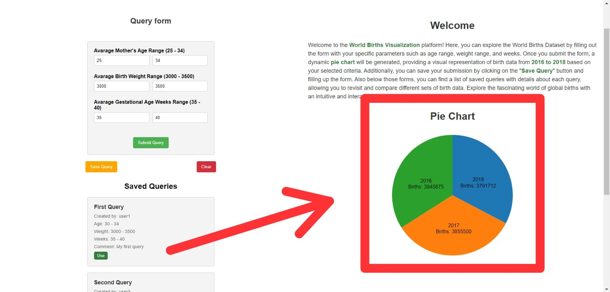

## How to use the app?

The first thing ypu will see when you enter to the webpage is something like this:

Let's take a look to every part in this webpage:

### Welcome text and Description

On the top-right corner you will find a text discribing step by step how to use the app and what it is for.

### Query Form

On the left of the webpage you will find a form where you can fill the search parameters that the app will consider when the query is performed. This fields have a range of valid inputs. Each field have in parenthesis the valid range. (It is not necessary to fill all the fields up, it will automatically fill all the empty ones with the default values)

You will also find 3 buttons on the bottom of the form. The green one that says "Submit Query" is to do the query and show a pie chart that discribes the query. The yellow one that says "Save Query" will display a form where you can save the query for you to use it again whenever ypu want. And the red one that says "Clear" is to clear all fields on the form.

### Pie Chart

Here you will see the resaults of your query displayed on a pie chat with the Year and Number of Births.

### Saving Form

Once you make your query if you want to save it to use it later you have click on the orange button on the query form. Anothe form will show up where you must fill all fields like username, name (of the query) and comment. Then you have to click the green button in this new form to save the query's information. If you change ypur mind and don't want to save it anymore you can click on the red button that says "Cancel", to cancel the saving process.

### Saved Queries

Right below the forms you will see a list that contains all queries that have been saved by different users. Each query have its Name, who saved it, the parameters saved and a comment. Also each one has a green button that says "Use", this is to reuse this query and show the corresponding pie chart. (Unfortunately this feature it's not available in this version of the app).

### Informative video

If you want to know more about the webpage check out this video: